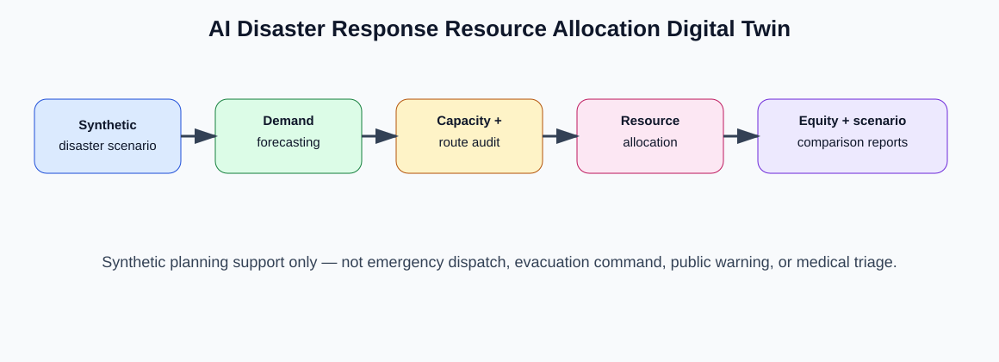
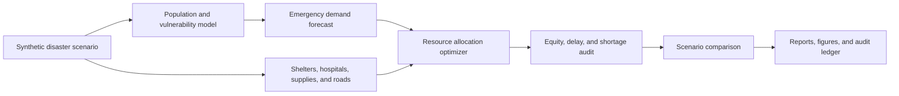

# AI Disaster Response Resource Allocation Digital Twin

<p align="center"><strong>Independent research-grade synthetic disaster-response digital twin for simulating emergency demand, shelter capacity, medical surge, supply shortages, route delays, vulnerable communities, and fair resource allocation.</strong></p>

<p align="center">
  <a href="../../actions/workflows/python-checks.yml"></a>
  <a href="LICENSE"></a>
  
  
</p>

> **Emergency-planning boundary:** this repository uses fictional synthetic zones, populations, shelters, hospitals, inventories, roads, and incident scenarios by default. It is independent disaster-response research and planning support only. It is not emergency dispatch software, official government advice, a public warning system, medical triage software, evacuation-command software, or a real-time life-safety decision system.

---

## Research objective

Can an AI disaster-response digital twin allocate emergency resources fairly and efficiently across vulnerable communities while reducing delay, shortage, and shelter-capacity risks?

| Research question | Evidence generated locally |
| --- | --- |
| Where is emergency demand highest? | Zone-level demand forecast and vulnerability scores |
| Which shelters and hospitals are under pressure? | Capacity and surge-pressure audit |
| Where are food, water, medicine, and rescue shortages likely? | Resource shortage table |
| Which routes are delayed or fragile? | Access-delay and route-risk audit |
| Is allocation fair to vulnerable communities? | Equity and service-gap audit |
| Which response policy performs best? | Scenario comparison and KPI summary |
| Can planning runs be reproduced? | JSON summary and hash-chained audit ledger |

---

## Architecture

<p align="center"></p>



---

## Run today — no real emergency data needed

```bash
python scripts/run_synthetic_disaster_lab.py
```

Windows quick start:

```bat
cd %USERPROFILE%\ai-disaster-response-resource-allocation-twin
git pull

py -m venv .venv
.venv\Scripts\activate

python -m pip install --upgrade pip
python -m pip install -r requirements.txt
python scripts/run_synthetic_disaster_lab.py
```

Optional larger run:

```bash
python scripts/run_synthetic_disaster_lab.py --zones 30 --facilities 14 --seed 42
```

Run tests:

```bash
python -m pytest -q
```

---

## Generated local outputs

```text
outputs/results/synthetic_disaster_scenario.csv
outputs/results/synthetic_zones.csv
outputs/results/synthetic_facilities.csv
outputs/results/synthetic_supply_inventory.csv
outputs/results/synthetic_road_links.csv
outputs/results/synthetic_emergency_demand.csv
outputs/results/synthetic_capacity_audit.csv
outputs/results/synthetic_resource_shortages.csv
outputs/results/synthetic_route_delay_audit.csv
outputs/results/synthetic_zone_access_summary.csv
outputs/results/synthetic_resource_allocation.csv
outputs/results/synthetic_equity_audit.csv
outputs/results/synthetic_scenario_comparison.csv
outputs/results/synthetic_disaster_response_summary.json
outputs/reports/synthetic_disaster_response_report.md
outputs/audit/disaster_response_audit_log.jsonl

outputs/figures/synthetic_demand_by_zone.png
outputs/figures/synthetic_capacity_pressure.png
outputs/figures/synthetic_resource_shortages.png
outputs/figures/synthetic_equity_gap.png
outputs/figures/synthetic_scenario_comparison.png
outputs/figures/synthetic_route_delay.png
```

---

## Digital twin modules

| Module | Purpose |
| --- | --- |
| Synthetic generator | Builds fictional zones, vulnerabilities, shelters, hospitals, roads, and resource inventories |
| Demand model | Forecasts shelter demand, medical demand, rescue demand, and supply demand |
| Capacity audit | Scores shelter occupancy pressure, hospital surge pressure, and supply stockout risk |
| Route-delay audit | Estimates access delay and road fragility under scenario stress |
| Allocation optimizer | Allocates food, water, medical kits, rescue teams, buses, and shelter beds |
| Equity audit | Flags under-service risk for vulnerable zones and compares service ratios |
| Scenario analysis | Compares baseline, equity-priority, medical-surge, logistics-priority, and evacuation-priority strategies |
| Reporting | Produces Markdown reports, CSVs, JSON summaries, figures, and audit logs |

---

## Independent emergency-planning boundary

This project supports synthetic planning, education, research prototyping, and reproducible analysis. Real disaster response requires trained responders, emergency-management authorities, verified field data, incident command processes, legal authority, medical oversight, and public communication governance.

The system should never be used as the sole basis for evacuation orders, emergency dispatch, medical triage, public warning, shelter admission, law-enforcement action, or real-time life-safety decisions.

---

## Repository map

```text
src/disastertwin/
  synthetic.py       # fictional zones, facilities, supplies, roads, and disaster parameters
  demand.py          # emergency demand forecasting
  capacity.py        # shelter, hospital, and inventory pressure audits
  routing.py         # route delay and access risk simulation
  allocation.py      # transparent resource allocation heuristics
  equity.py          # vulnerable-zone service-gap audit
  scenarios.py       # response strategy comparison
  audit.py           # hash-chained audit ledger
  visualization.py   # local figures
  reporting.py       # Markdown disaster-response report
scripts/
  run_synthetic_disaster_lab.py
docs/
  methodology.md
  emergency_planning_boundary.md
  synthetic_lab.md
  report_template.md
tests/
  test_synthetic.py
  test_disaster_modules.py
  test_pipeline.py
  test_audit.py
```

---

## Limitations

- Synthetic data validates the pipeline but does not prove real-world disaster-response performance.
- Allocation outputs are planning prompts, not dispatch orders.
- Fairness metrics are descriptive and require emergency-management interpretation.
- Real use requires verified data, trained responders, legal authority, incident command, and field validation.
